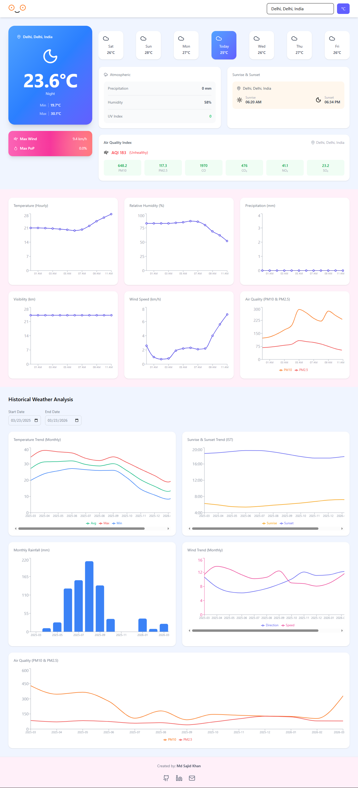

# Weather Dashboard

A React-based weather dashboard that shows current weather, hourly analytics, and historical trends using Open-Meteo APIs.

---

## Live Demo

[Visit Weather Dashboard](https://weatherdashboard-sajid.netlify.app/)

---

## Preview



---

## Features

- Current weather (temperature, humidity, wind)
- 7-day forecast with centered current day
- Hourly charts for temperature, humidity, precipitation, etc.
- Historical data (temperature, wind, rainfall, air quality)
- AQI calculation based on PM2.5
- Unit conversion (°C / °F)

---

## Tech Stack

- React (Vite)
- Tailwind CSS
- Recharts
- Lucide Icons

---

## Setup

Clone the repository:

```bash
git clone <your-repo-link>
cd weather-dashboard
```

Install dependencies:

```bash
npm install
```

---

## Environment Variables

Create a `.env` file in the root

APIs are from: [https://open-meteo.com/](https://open-meteo.com/)

---

## Run

```bash
npm run dev
```

Open: [http://localhost:5173](http://localhost:5173/)

---

## Notes

- Uses Open-Meteo (no API key required)
- Focus on clean UI and data handling
